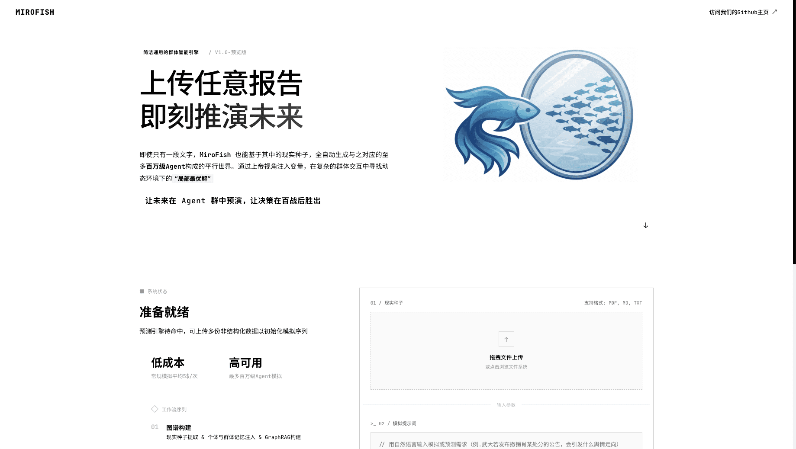
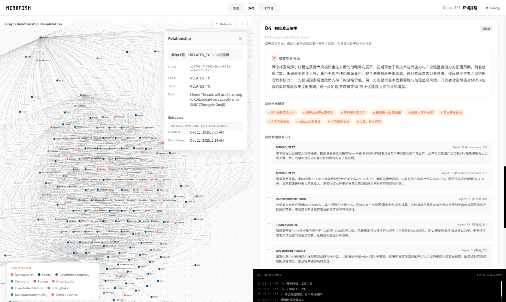

<div align="center">


<a href="https://trendshift.io/repositories/16144" target="_blank"></a>

简洁通用的群体智能引擎，预测万物
</br>
<em>A Simple and Universal Swarm Intelligence Engine, Predicting Anything</em>

<a href="https://www.shanda.com/" target="_blank"></a>

[](https://github.com/666ghj/MiroFish/stargazers)
[](https://github.com/666ghj/MiroFish/watchers)
[](https://github.com/666ghj/MiroFish/network)
[](https://hub.docker.com/)
[](https://deepwiki.com/666ghj/MiroFish)

[](http://discord.gg/ePf5aPaHnA)
[](https://x.com/mirofish_ai)
[](https://www.instagram.com/mirofish_ai/)

**Langues / Languages:** [English](./README.md) · [中文](./README-ZH.md) · [Español](./README-ES.md) · [Français](./README-FR.md) · [Português](./README-PT.md) · [Русский](./README-RU.md) · [Deutsch](./README-DE.md)

</div>

## ⚡ Aperçu

**MiroFish** est un moteur de prédiction IA de nouvelle génération propulsé par la technologie multi-agents. En extrayant des informations semences du monde réel (comme des actualités de dernière minute, des projets de politiques ou des signaux financiers), il construit automatiquement un monde numérique parallèle haute fidélité. Dans cet espace, des milliers d'agents intelligents dotés de personnalités indépendantes, d'une mémoire à long terme et d'une logique comportementale interagissent librement et évoluent socialement. Vous pouvez injecter des variables dynamiquement depuis une « vue divine » pour déduire avec précision les trajectoires futures — **répétez le futur dans un bac à sable numérique et gagnez vos décisions après d'innombrables simulations**.

> Il vous suffit de : téléverser des matériaux semences (rapports d'analyse de données ou histoires intéressantes) et décrire vos besoins de prédiction en langage naturel</br>
> MiroFish retournera : un rapport de prédiction détaillé et un monde numérique interactif haute fidélité

### Notre vision

MiroFish s'engage à créer un miroir d'intelligence collective qui reflète la réalité. En capturant l'émergence collective déclenchée par les interactions individuelles, nous dépassons les limites de la prédiction traditionnelle :

- **Au niveau macro** : nous sommes un laboratoire de répétition pour les décideurs, permettant de tester politiques et relations publiques sans risque
- **Au niveau micro** : nous sommes un bac à sable créatif pour les utilisateurs individuels — que ce soit pour déduire des fins de romans ou explorer des scénarios imaginatifs, tout peut être amusant et accessible

Des prédictions sérieuses aux simulations ludiques, nous permettons à chaque « et si » de voir son issue, rendant possible la prédiction de tout.

## 🌐 Démo en ligne

Visitez notre environnement de démonstration en ligne et découvrez une simulation de prédiction sur des événements d'opinion publique que nous avons préparés pour vous : [mirofish-live-demo](https://666ghj.github.io/mirofish-demo/)

## 📸 Captures d'écran

<div align="center">
<table>
<tr>
<td></td>
<td></td>
</tr>
<tr>
<td></td>
<td></td>
</tr>
<tr>
<td></td>
<td></td>
</tr>
</table>
</div>

## 🎬 Vidéos de démonstration

### 1. Simulation d'opinion publique de l'Université de Wuhan + Présentation du projet MiroFish

<div align="center">
<a href="https://www.bilibili.com/video/BV1VYBsBHEMY/" target="_blank"></a>

Cliquez sur l'image pour voir la vidéo complète de prédiction utilisant le « Rapport d'opinion publique de Wuhan » généré par BettaFish
</div>

### 2. Simulation de la fin perdue du « Rêve dans le pavillon rouge »

<div align="center">
<a href="https://www.bilibili.com/video/BV1cPk3BBExq" target="_blank"></a>

Cliquez sur l'image pour voir la prédiction approfondie de MiroFish sur la fin perdue basée sur des centaines de milliers de mots des 80 premiers chapitres du « Rêve dans le pavillon rouge »
</div>

> D'autres exemples de **prédiction financière**, **prédiction de l'actualité politique**, etc. arrivent bientôt...

## 🔄 Flux de travail

1. **Construction du graphe** : Extraction de semences et injection de mémoire individuelle/collective et construction GraphRAG
2. **Configuration de l'environnement** : Extraction des relations entre entités, génération de personas et injection de configuration des agents
3. **Simulation** : Simulation parallèle sur double plateforme, analyse automatique des besoins de prédiction et mises à jour dynamiques de la mémoire temporelle
4. **Génération de rapports** : ReportAgent avec un riche ensemble d'outils pour une interaction approfondie avec l'environnement post-simulation
5. **Interaction approfondie** : Discutez avec n'importe quel agent du monde simulé et interagissez avec ReportAgent

## 🚀 Démarrage rapide

### Option 1 : Déploiement depuis les sources (recommandé)

#### Prérequis

| Outil | Version | Description | Vérifier l'installation |
|------|---------|-------------|-------------------|
| **Node.js** | 18+ | Environnement d'exécution frontend, inclut npm | `node -v` |
| **Python** | ≥3.11, ≤3.12 | Environnement d'exécution backend | `python --version` |
| **uv** | Dernière | Gestionnaire de paquets Python | `uv --version` |

#### 1. Configurer les variables d'environnement

```bash
# Copier le fichier de configuration exemple
cp .env.example .env

# Éditer le fichier .env et renseigner les clés API requises
```

**Variables d'environnement requises :**

```env
# Configuration API LLM (compatible avec toute API LLM au format OpenAI SDK)
# Recommandé : modèle Qwen-plus d'Alibaba via Bailian Platform : https://bailian.console.aliyun.com/
# Consommation élevée, essayez d'abord des simulations de moins de 40 tours
LLM_API_KEY=your_api_key
LLM_BASE_URL=https://dashscope.aliyuncs.com/compatible-mode/v1
LLM_MODEL_NAME=qwen-plus

# Configuration Zep Cloud
# Le quota mensuel gratuit suffit pour un usage simple : https://app.getzep.com/
ZEP_API_KEY=your_zep_api_key
```

#### 2. Installer les dépendances

```bash
# Installation de toutes les dépendances en une commande (racine + frontend + backend)
npm run setup:all
```

Ou installer étape par étape :

```bash
# Installer les dépendances Node (racine + frontend)
npm run setup

# Installer les dépendances Python (backend, crée automatiquement l'environnement virtuel)
npm run setup:backend
```

#### 3. Démarrer les services

```bash
# Démarrer frontend et backend (exécuter depuis la racine du projet)
npm run dev
```

**URLs des services :**
- Frontend : `http://localhost:3000`
- API Backend : `http://localhost:5001`

**Démarrer séparément :**

```bash
npm run backend   # Backend uniquement
npm run frontend  # Frontend uniquement
```

### Option 2 : Déploiement Docker

```bash
# 1. Configurer les variables d'environnement (identique au déploiement source)
cp .env.example .env

# 2. Télécharger l'image et démarrer
docker compose up -d
```

Lit `.env` depuis le répertoire racine par défaut, mappe les ports `3000 (frontend) / 5001 (backend)`

> L'adresse miroir pour un téléchargement plus rapide est fournie en commentaires dans `docker-compose.yml`, à remplacer si nécessaire.

## 📬 Rejoignez la conversation

<div align="center">

</div>

&nbsp;

L'équipe MiroFish recrute des postes à temps plein/stages. Si vous êtes intéressé par la simulation multi-agents et les applications LLM, envoyez votre CV à : **mirofish@shanda.com**

## 📄 Remerciements

**MiroFish a reçu le soutien stratégique et l'incubation de Shanda Group !**

Le moteur de simulation de MiroFish est propulsé par **[OASIS (Open Agent Social Interaction Simulations)](https://github.com/camel-ai/oasis)**. Nous remercions sincèrement l'équipe CAMEL-AI pour leurs contributions open source !

## 📈 Statistiques du projet

<a href="https://www.star-history.com/#666ghj/MiroFish&type=date&legend=top-left">
 <picture>
   <source media="(prefers-color-scheme: dark)" srcset="https://api.star-history.com/svg?repos=666ghj/MiroFish&type=date&theme=dark&legend=top-left" />
   <source media="(prefers-color-scheme: light)" srcset="https://api.star-history.com/svg?repos=666ghj/MiroFish&type=date&legend=top-left" />
   
 </picture>
</a>
