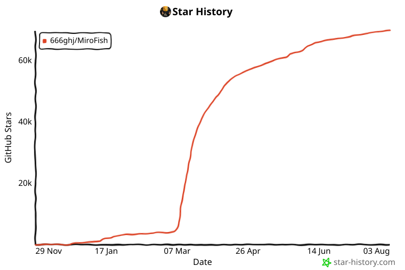

<div align="center">


<a href="https://trendshift.io/repositories/16144" target="_blank"></a>

简洁通用的群体智能引擎，预测万物
</br>
<em>A Simple and Universal Swarm Intelligence Engine, Predicting Anything</em>

<a href="https://www.shanda.com/" target="_blank"></a>

[](https://github.com/666ghj/MiroFish/stargazers)
[](https://github.com/666ghj/MiroFish/watchers)
[](https://github.com/666ghj/MiroFish/network)
[](https://hub.docker.com/)
[](https://deepwiki.com/666ghj/MiroFish)

[](http://discord.gg/ePf5aPaHnA)
[](https://x.com/mirofish_ai)
[](https://www.instagram.com/mirofish_ai/)

[English](./README.md) | [中文文档](./README-ZH.md)

</div>

## ⚡ Overview

**MiroFish** is a next-generation AI prediction engine powered by multi-agent technology. By extracting seed information from the real world (such as breaking news, policy drafts, or financial signals), it automatically constructs a high-fidelity parallel digital world. Within this space, thousands of intelligent agents with independent personalities, long-term memory, and behavioral logic freely interact and undergo social evolution. You can inject variables dynamically from a "God's-eye view" to precisely deduce future trajectories — **rehearse the future in a digital sandbox, and win decisions after countless simulations**.

> You only need to: Upload seed materials (data analysis reports or interesting novel stories) and describe your prediction requirements in natural language</br>
> MiroFish will return: A detailed prediction report and a deeply interactive high-fidelity digital world

### Our Vision

MiroFish is dedicated to creating a swarm intelligence mirror that maps reality. By capturing the collective emergence triggered by individual interactions, we break through the limitations of traditional prediction:

- **At the Macro Level**: We are a rehearsal laboratory for decision-makers, allowing policies and public relations to be tested at zero risk
- **At the Micro Level**: We are a creative sandbox for individual users — whether deducing novel endings or exploring imaginative scenarios, everything can be fun, playful, and accessible

From serious predictions to playful simulations, we let every "what if" see its outcome, making it possible to predict anything.

## 🌐 Live Demo

Welcome to visit our online demo environment and experience a prediction simulation on trending public opinion events we've prepared for you: [mirofish-live-demo](https://666ghj.github.io/mirofish-demo/)

## 📸 Screenshots

<div align="center">
<table>
<tr>
<td></td>
<td></td>
</tr>
<tr>
<td></td>
<td></td>
</tr>
<tr>
<td></td>
<td></td>
</tr>
</table>
</div>

## 🎬 Demo Videos

### 1. Wuhan University Public Opinion Simulation + MiroFish Project Introduction

<div align="center">
<a href="https://www.bilibili.com/video/BV1VYBsBHEMY/" target="_blank"></a>

Click the image to watch the complete demo video for prediction using BettaFish-generated "Wuhan University Public Opinion Report"
</div>

### 2. Dream of the Red Chamber Lost Ending Simulation

<div align="center">
<a href="https://www.bilibili.com/video/BV1cPk3BBExq" target="_blank"></a>

Click the image to watch MiroFish's deep prediction of the lost ending based on hundreds of thousands of words from the first 80 chapters of "Dream of the Red Chamber"
</div>

> **Financial Prediction**, **Political News Prediction** and more examples coming soon...

## 🔄 Workflow

1. **Graph Building**: Seed extraction & Individual/collective memory injection & GraphRAG construction
2. **Environment Setup**: Entity relationship extraction & Persona generation & Agent configuration injection
3. **Simulation**: Dual-platform parallel simulation & Auto-parse prediction requirements & Dynamic temporal memory updates
4. **Report Generation**: ReportAgent with rich toolset for deep interaction with post-simulation environment
5. **Deep Interaction**: Chat with any agent in the simulated world & Interact with ReportAgent

## 🔒 Fully Local Deployment (UXE fork)

This fork runs MiroFish with **no hosted service of any kind** — no LLM API, no Zep
Cloud. Everything, including inference, executes on one machine.

Target hardware is an **NVIDIA DGX Spark** (GB10, aarch64, 128GB unified memory),
but any Linux box with Docker and an NVIDIA runtime works.

### What we changed and why

Upstream MiroFish depends on two hosted services. The LLM was a config change; Zep
was not.

| Change | Why |
|---|---|
| **Added `third_party/graphiti`** submodule ([our fork](https://github.com/uxe-security-solutions/graphiti)) | Contains `server/graph_service/zep_compat/`, a Zep Cloud v2 API implementation backed by Graphiti — the same open-source temporal knowledge graph engine Zep Cloud is built on. Zep Community Edition is discontinued and no self-hostable Zep server exists, so this had to be written. |
| **`ZEP_BASE_URL`** in [`backend/app/utils/zep.py`](backend/app/utils/zep.py) | Upstream hard-coded `https://api.getzep.com/api/v2` and rejected any override. Unset, behaviour is unchanged; set, the SDK talks to the local shim. `ZEP_API_URL` stays rejected — the SDK honours it over an explicit `base_url`, so allowing both would make the effective endpoint ambiguous. |
| **`ZEP_INGESTION_WAIT_TIMEOUT_SECONDS`** now configurable | Was a hard-coded 600s. Cloud ingests well inside that; a local LLM extracting entities from a few hundred chunks does not, and overrunning raises `TimeoutError` while ingestion is still healthy. |
| **Frontend uses same-origin URLs** ([`frontend/src/api/index.js`](frontend/src/api/index.js)) | The default `http://localhost:5001` was resolved by the *browser*, so opening the UI from any other machine hit that machine's own port 5001 and failed. Every request path already starts with `/api`, which Vite proxies. **This is why only one port needs exposing.** |
| **Vite config hardened** ([`frontend/vite.config.js`](frontend/vite.config.js)) | `open: false` (headless boxes have no `xdg-open`), `strictPort: true` (it silently slid to 3001, leaving firewall rules pointing at nothing), `host: true`, and `allowedHosts` via env. |
| **Google Fonts removed** ([`frontend/index.html`](frontend/index.html)) | The only external request the frontend made; on an air-gapped box it stalls first paint until it times out. Install `fonts-inter fonts-jetbrains-mono fonts-noto-cjk` to keep the intended look — the provisioning script does. |
| **Added [`backend/conftest.py`](backend/conftest.py)** | `pytest` worked only via `python -m pytest`; now either form does. |
| **Added [`scripts/provision_local.sh`](scripts/provision_local.sh)** | One script for the whole stack. |

### Prerequisites

Docker with a working NVIDIA container runtime, `sudo` for package installs, and
~120GB free disk. The script installs everything else (uv, Node 22, build tools).

> Node 18 is **not** enough despite `package.json` saying so — the pinned Vite 7
> requires `^20.19 || >=22.12`, and `npm ci` only warns. The script installs Node 22.

### Running it

```bash
git clone --recurse-submodules git@github.com:uxe-security-solutions/MiroFish.git
cd MiroFish
./scripts/provision_local.sh all
```

If you cloned without `--recurse-submodules`, the script initialises the submodule
itself. `all` = `setup` then `start`:

```bash
./scripts/provision_local.sh setup    # packages, submodule, .env, images, models — NEEDS NETWORK
./scripts/provision_local.sh start    # bring the stack up — fully offline
./scripts/provision_local.sh status   # what is up, and where
./scripts/provision_local.sh logs llm # or: backend, zep-shim, frontend, embed, falkordb
./scripts/provision_local.sh doctor   # verify GPU arch, arm64 manifests, config sanity
./scripts/provision_local.sh test     # run both test suites (no GPU, no network)
./scripts/provision_local.sh stop
```

`setup` is the only stage that touches the internet. After it completes the machine
can be disconnected: `HF_HUB_OFFLINE=1`, `TRANSFORMERS_OFFLINE=1` and
`GRAPHITI_TELEMETRY_ENABLED=false` are set in `.env.example`.

Review `.env` before the first `start` — it is created from `.env.example` and never
overwritten.

### Ports to open on the network

**Expose exactly one port.**

| Port | Service | Expose? |
|---|---|---|
| **3000** | Frontend (Vite) | **Yes** — this is the whole application. It proxies `/api` to the backend. |
| 5001 | Backend API (Flask) | No — reached through the frontend proxy |
| 8088 | Zep-compatible shim | No |
| 8000 | vLLM (OpenAI-compatible) | No |
| 8081 | Embeddings (TEI) | No |
| 6379 | FalkorDB | No |
| 3001 | FalkorDB browser UI | No — handy over an SSH tunnel |

Everything except 3000 binds to `127.0.0.1`, so a host firewall is a backstop, not
the primary control. For example:

```bash
sudo ufw allow 3000/tcp
```

Then open `http://<dgx-ip>:3000`. To reach it by hostname instead of IP, set
`VITE_ALLOWED_HOSTS` in `.env` — Vite rejects unknown `Host` headers (bare IPs
always work).

For anything beyond a trusted LAN, put a reverse proxy with TLS in front of 3000
rather than exposing Vite's dev server directly. Note the backend has no auth of
its own: whoever reaches the UI can drive simulations.

### What runs where

```
browser ──▶ :3000 Vite ──/api──▶ :5001 backend ──▶ :8088 Zep shim ──▶ :6379 FalkorDB
                                      │                   │
                                      └───────────────────┴──▶ :8000 vLLM  (agents + extraction)
                                                          └──▶ :8081 TEI   (embeddings)
```

The shim needs an embeddings endpoint because Zep Cloud did embedding server-side
and Graphiti does not. `EMBEDDING_DIM` is **a one-way door**: the vector index
dimension is fixed at creation, so changing embedders later means re-embedding
every graph. The default (bge-m3, 1024) matches Graphiti's default exactly.

### Model choices

Defaults are set in `scripts/provision_local.sh` and overridable by environment:

- **LLM** — `RedHatAI/Qwen3.6-35B-A3B-NVFP4`. A Mixture-of-Experts model is the
  right shape here: GB10 has ~273 GB/s of bandwidth, decode is bandwidth-bound, and
  MoE reads far fewer weights per token.
- **Embeddings** — `BAAI/bge-m3` on TEI, on the Grace CPU cores, leaving the whole
  GPU budget to the LLM.
- **Graph DB** — FalkorDB (Redis-based, no JVM). Neo4j works too:
  `GRAPHITI_DB_BACKEND=neo4j`.

Two different requirements land on that one LLM endpoint, and both matter:

- OASIS agents use **native OpenAI tool calling**. Without
  `--enable-auto-tool-choice --tool-call-parser`, every agent silently does nothing.
- Graphiti uses **`response_format: json_schema`**, not tool calling. Its lever is
  vLLM's structured-output backend. Tuning tool-call flags does nothing for
  extraction quality.

### Sizing and expectations, honestly

- `GPU_MEM_UTIL` defaults to a conservative `0.75`. It is a fraction of *total*
  device memory, and on unified memory that competes with the OS, the container
  runtime and the page cache. `0.90` has been reported getting the engine
  SIGTERM'd by `earlyoom`, which does **not** look like an OOM in the logs.
- `MAX_NUM_SEQS` defaults to 16, and MiroFish's own OASIS concurrency is 30.
  Independent reports put practical GB10 concurrency at 5–10 before latency
  degrades badly, and NVIDIA's own vLLM playbook uses `--max-num-seqs 4`. Sweep
  1/4/8/16/32 and measure p95 latency before trusting a number.
- Start with **few agents and few rounds**. Every round is many LLM calls per
  agent; upstream warns that even paid APIs get expensive past 40 rounds.
- A **Twitter** simulation loads `Twitter/twhin-bert-base` (~1GB) for its
  recommender; `setup` pre-caches it. **Reddit** needs no model at all, so
  Reddit-only runs are the lighter path.
- MiroFish's own Python process gets **CPU-only torch** on aarch64 (no CUDA wheels
  there). That is fine — it only uses torch for the small recommender model. The
  GPU is for the vLLM server.

### Testing without a GPU

Both suites run on a laptop, no GPU, no network, no LLM:

```bash
./scripts/provision_local.sh test
```

The shim's tests are worth knowing about, because they are what makes the
drop-in claim checkable:

- `test_zep_compat_contract.py` — serialises every response model and parses it
  with **zep-cloud's own** `parse_obj_as`, the exact code MiroFish runs.
- `test_zep_compat_e2e.py` — drives the shim with a **real `AsyncZep` client** over
  an ASGI transport: real paths, bodies, error mapping, and the header-based
  pagination cursor.
- `test_zep_compat_store.py` — the batch invariants MiroFish's reconciliation
  depends on (global `sequence_index`, cursors that must advance, restart
  durability).
- `test_zep_compat_integration.py` — opt-in, against a real FalkorDB:

  ```bash
  docker run -d --name falkordb-it -p 6399:6379 falkordb/falkordb:latest
  cd third_party/graphiti/server
  ZEP_COMPAT_IT=1 FALKORDB_IT_PORT=6399 uv run --extra dev pytest tests/test_zep_compat_integration.py -v
  ```

### Known limitations

- **Not every Zep endpoint is implemented** — only the 17 MiroFish actually calls.
  `third_party/graphiti/server/graph_service/zep_compat/WIRE_SPEC.md` lists the
  contract and how it was derived. Users, threads and fact-triples are not covered.
- **`graph_id` becomes a database name.** Graphiti 0.29.3 maps `group_id` onto the
  graph database name, so each MiroFish graph is a separate FalkorDB database and
  the shim keeps one Graphiti instance per graph. Node and episode UUIDs are only
  resolvable inside their own graph, so the shim keeps a UUID→graph index for the
  two Zep routes that look up a UUID with no `graph_id`.
- **`uuid_cursor` paging is broken on FalkorDB** in graphiti-core 0.29.3: the
  `WHERE n.uuid < $uuid` clause is silently not applied, so every page comes back
  identical. The shim pages with `SKIP`/`LIMIT` instead
  (`zep_compat/paging.py`). That is stable as long as the graph is not written
  during a drain, which holds because MiroFish reads only after a batch reaches a
  terminal status.
- **Extraction quality depends on the local model** honouring `json_schema`. If
  entity extraction comes back thin, that is the thing to tune first — try a larger
  model before blaming the pipeline.
- The report agent uses text `<tool_call>` tags rather than the tool-calling API, so
  it is the most model-agnostic part of the system.

## 🚀 Quick Start (upstream: hosted LLM + Zep Cloud)

> For the fully local path see [Fully Local Deployment](#-fully-local-deployment-uxe-fork) above.


### Option 1: Source Code Deployment (Recommended)

#### Prerequisites

| Tool | Version | Description | Check Installation |
|------|---------|-------------|-------------------|
| **Node.js** | 18+ | Frontend runtime, includes npm | `node -v` |
| **Python** | ≥3.11, ≤3.12 | Backend runtime | `python --version` |
| **uv** | Latest | Python package manager | `uv --version` |

#### 1. Configure Environment Variables

```bash
# Copy the example configuration file
cp .env.example .env

# Edit the .env file and fill in the required API keys
```

**Required Environment Variables:**

```env
# LLM API Configuration (supports any LLM API with OpenAI SDK format)
# Recommended: Alibaba Qwen-plus model via Bailian Platform: https://bailian.console.aliyun.com/
# High consumption, try simulations with fewer than 40 rounds first
LLM_API_KEY=your_api_key
LLM_BASE_URL=https://dashscope.aliyuncs.com/compatible-mode/v1
LLM_MODEL_NAME=qwen-plus

# Zep Cloud Configuration
# Free monthly quota is sufficient for simple usage: https://app.getzep.com/
ZEP_API_KEY=your_zep_api_key
```

#### 2. Install Dependencies

```bash
# One-click installation of all dependencies (root + frontend + backend)
npm run setup:all
```

Or install step by step:

```bash
# Install Node dependencies (root + frontend)
npm run setup

# Install Python dependencies (backend, auto-creates virtual environment)
npm run setup:backend
```

#### 3. Start Services

```bash
# Start both frontend and backend (run from project root)
npm run dev
```

**Service URLs:**
- Frontend: `http://localhost:3000`
- Backend API: `http://localhost:5001`

**Start Individually:**

```bash
npm run backend   # Start backend only
npm run frontend  # Start frontend only
```

### Option 2: Docker Deployment

```bash
# 1. Configure environment variables (same as source deployment)
cp .env.example .env

# 2. Pull image and start
docker compose up -d
```

Reads `.env` from root directory by default, maps ports `3000 (frontend) / 5001 (backend)`

> Mirror address for faster pulling is provided as comments in `docker-compose.yml`, replace if needed.

## 📬 Join the Conversation

<div align="center">

</div>

&nbsp;

The MiroFish team is recruiting full-time/internship positions. If you're interested in multi-agent simulation and LLM applications, feel free to send your resume to: **mirofish@shanda.com**

## 📄 Acknowledgments

**MiroFish has received strategic support and incubation from Shanda Group!**

MiroFish's simulation engine is powered by **[OASIS (Open Agent Social Interaction Simulations)](https://github.com/camel-ai/oasis)**, We sincerely thank the CAMEL-AI team for their open-source contributions!

## 📈 Project Statistics

<a href="https://github.com/666ghj/MiroFish">
 <picture>
   <source media="(prefers-color-scheme: dark)" srcset="static/image/star-history-dark.svg" />
   <source media="(prefers-color-scheme: light)" srcset="static/image/star-history-light.svg" />
   
 </picture>
</a>
